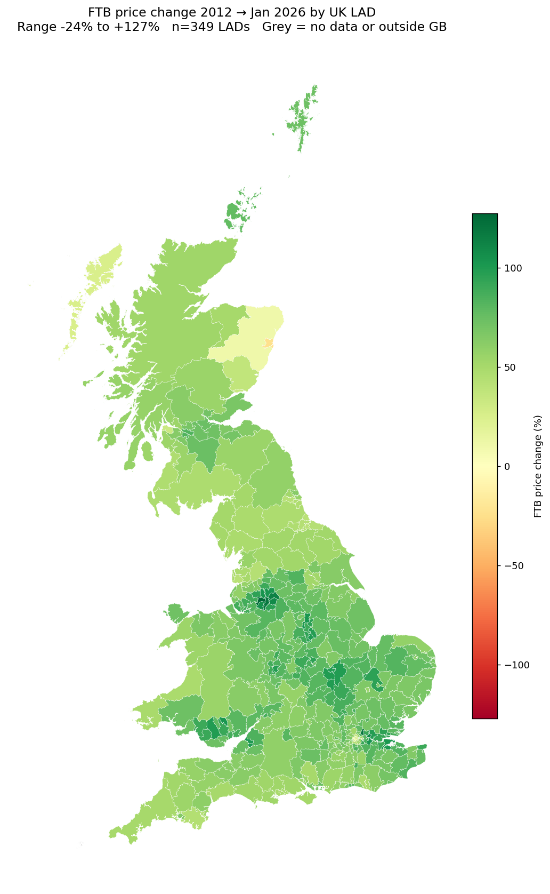
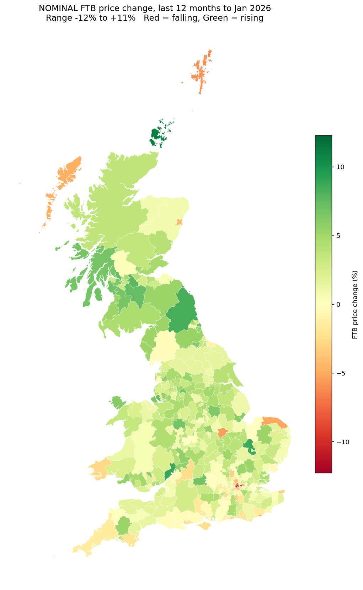

# UK First-Time Buyer Price Analysis, 2011 – January 2026

## Answer up front

UK first-time-buyer (FTB) average prices have risen **+72% since 2012**
(£131k → £226k), but the county-level picture is highly uneven: growth
ranges from **+127% in Salford to −24% in City of Aberdeen**, with
prime-central-London boroughs now falling sharply even as the rest of
the UK continues to rise.

Three patterns dominate the data:

1. **Former industrial northern cities have converged toward the UK
   average.** Salford, Manchester, Oldham, Tameside, Rochdale and Bury
   all more than doubled. These are the single largest growth cluster
   on the map.
2. **Prime central London is in a multi-year correction.** Kensington
   & Chelsea, Westminster, Camden, Hammersmith & Fulham, Tower Hamlets
   and the City are all the worst performers in the last 12 months
   (−6% to −12%) **and** sit in the bottom-10 for full-period growth.
3. **The affordability gap between FTBs and former owner-occupiers has
   widened from about £64k in 2012 to £103k today** (UK), so even where
   FTB prices have risen slowly, deposit/income requirements have
   tightened relative to the rest of the market.

An interactive, year-by-year version is at
[`outputs/uk_ftb_interactive.html`](outputs/uk_ftb_interactive.html)
(drag the slider or press Play).

## Dataset and method

| Field | Value |
|---|---|
| Source | HM Land Registry FTB / Former-owner-occupier series, extract 2026-01 |
| Rows | 66,476 monthly observations |
| Date range | 2011-01-01 to 2026-01-01 |
| Unique regions | 391 (349 Local Authority Districts + nation/UK aggregates) |
| LAD boundaries | ONS 2013 (via `martinjc/UK-GeoJSON` mirror) |

**Baseline choice.** UK, England and Wales aggregates in this extract
start in January 2012; only Scottish LADs have 2011 data. All
full-period growth figures below therefore use the **2012 full-year
mean** as the baseline, which keeps cross-nation comparisons aligned.

**Code reconciliation.** The dataset carries post-2013 LAD codes for
the 2019–2023 unitary reorganisations (Dorset, Buckinghamshire,
Somerset, North Yorkshire, Cumberland, Westmorland & Furness, North/West
Northamptonshire, East/West Suffolk, BCP). We expanded each new code
onto its constituent 2013 polygons so that the new unitary's FTB value
is rendered across the same geographic footprint. Only **Isles of
Scilly** is absent (not present in the FTB series).

**Caveats.**
- Northern Ireland is not in the FTB series and does not appear.
- The "growth" metric here is unsmoothed average price; mix effects
  (what sort of homes first-time buyers actually purchase each year)
  are not adjusted for, so year-on-year numbers can be volatile in
  small or high-value LADs.
- The 2012 baseline understates total growth for Scotland vs. 2011.

## National trend

| Nation | Baseline (2011/12) | Jan 2026 | Total % | CAGR % | Latest 12m % | FTB ÷ FOO |
|---|---:|---:|---:|---:|---:|---:|
| UK       | £131,358 (2012) | £226,465 | +72.4 | +4.09 | +1.3 | 0.69 |
| England  | £140,077 (2012) | £243,308 | +73.7 | +4.15 | +1.2 | 0.69 |
| Scotland | £102,836 (2011) | £154,711 | +50.4 | +2.84 | +1.9 | 0.66 |
| Wales    | £103,586 (2012) | £180,859 | +74.6 | +4.19 | +2.4 | 0.72 |

Key observations:
- **Scotland is the most affordable nation and has grown the slowest.**
  This reflects its comparatively modest 2013–2019 expansion and a
  distinct Aberdeen-area oil-price shock that pulled the aggregate down.
- **Wales is currently the hottest nation at +2.4% year-on-year**, vs.
  +1.3% for the UK as a whole.
- **The FTB/FOO ratio has barely moved since 2012** (UK ≈ 0.69): FTBs
  are still buying properties priced ~31% below the market average.
  But because both have appreciated by similar percentages, the
  absolute cash gap has widened from about £64k to £103k.

## Top and bottom LADs (full period)

**Top 10 (2012 → Jan 2026)** — almost entirely Greater Manchester plus
outer-London boroughs:

| LAD | Code | 2012 £ | Jan 2026 £ | % change | CAGR |
|---|---|---:|---:|---:|---:|
| Salford | E08000006 | 91,523 | 208,046 | +127.3% | +6.23% |
| Manchester | E08000003 | 108,491 | 237,580 | +119.0% | +5.94% |
| Waltham Forest | E09000031 | 217,669 | 475,595 | +118.5% | +5.92% |
| Oldham | E08000004 | 91,829 | 195,108 | +112.5% | +5.70% |
| Tameside | E08000008 | 92,916 | 194,304 | +109.1% | +5.58% |
| Barking and Dagenham | E09000002 | 164,623 | 343,754 | +108.8% | +5.57% |
| Trafford | E08000009 | 149,929 | 308,187 | +105.6% | +5.45% |
| Rochdale | E08000005 | 92,016 | 186,832 | +103.0% | +5.35% |
| Bury | E08000002 | 103,602 | 210,088 | +102.8% | +5.34% |
| Bexley | E09000004 | 178,798 | 362,151 | +102.5% | +5.33% |

**Bottom 10** — prime central London plus north-east Scotland:

| LAD | Code | 2012 £ | Jan 2026 £ | % change | CAGR |
|---|---|---:|---:|---:|---:|
| City of Aberdeen | S12000033 | 149,574 | 113,765 | **−23.9%** | −1.99% |
| Kensington and Chelsea | E09000020 | 940,168 | 1,031,685 | +9.7% | +0.69% |
| Aberdeenshire | S12000034 | 141,975 | 156,433 | +10.2% | +0.72% |
| City of Westminster | E09000033 | 666,312 | 812,682 | +22.0% | +1.47% |
| Hammersmith and Fulham | E09000013 | 511,143 | 634,628 | +24.2% | +1.61% |
| Na h-Eileanan Siar | S12000013 | 88,243 | 110,555 | +25.3% | +1.67% |
| Inverclyde | S12000018 | 71,597 | 94,556 | +32.1% | +2.07% |
| Camden | E09000007 | 514,309 | 690,930 | +34.3% | +2.20% |
| City of Dundee | S12000042 | 90,301 | 121,603 | +34.7% | +2.21% |
| Angus | S12000041 | 101,556 | 139,417 | +37.3% | +2.36% |

**City of Aberdeen is the only LAD in the dataset where the FTB price
is lower in 2026 than it was in 2012.** This is consistent with the
oil-price collapse that began in 2014 and which appears never to have
been fully recovered in the local housing market.

## Latest 12 months — who is rising and falling now?

**Top 10 growth, 12 months to Jan 2026:**

| LAD | 12-month % |
|---|---:|
| Orkney Islands | +11.1% |
| Forest of Dean | +8.9% |
| East Cambridgeshire | +8.7% |
| Northumberland | +8.3% |
| North Lanarkshire | +7.7% |
| West Dunbartonshire | +7.5% |
| Liverpool | +7.4% |
| South Lanarkshire | +7.3% |
| South Tyneside | +7.2% |
| North Ayrshire | +6.9% |

**Bottom 10 (biggest falls), 12 months to Jan 2026:**

| LAD | 12-month % |
|---|---:|
| Kensington and Chelsea | −12.3% |
| City of Westminster | −10.2% |
| Tower Hamlets | −9.1% |
| Camden | −8.8% |
| Hammersmith and Fulham | −6.3% |
| City of London | −6.2% |
| Shetland Islands | −5.9% |
| Rutland | −5.4% |
| North Norfolk | −5.1% |
| Na h-Eileanan Siar | −4.8% |

Six of the ten steepest 12-month falls are inner-London boroughs; the
rest are low-volume rural/island markets where single transactions can
move the monthly average several percent.

## Affordability gap (UK)

The gap between what first-time buyers and former owner-occupiers
typically pay has widened from **≈£64k in 2012 to ≈£103k in 2026** (UK
aggregate) despite the FTB/FOO price *ratio* staying near 0.69
throughout. The cash gap matters for deposit requirements; a 10%
deposit at the UK FTB average alone has increased from ~£13k to ~£23k
over the period.

## Price levels today (Jan 2026)

**Most expensive LADs**

| LAD | Latest FTB £ |
|---|---:|
| Kensington and Chelsea | 1,031,685 |
| City of Westminster | 812,682 |
| City of London | 717,681 |
| Camden | 690,930 |
| Hammersmith and Fulham | 634,628 |

**Cheapest LADs**

| LAD | Latest FTB £ |
|---|---:|
| Inverclyde | 94,556 |
| East Ayrshire | 108,818 |
| Na h-Eileanan Siar | 110,555 |
| West Dunbartonshire | 112,135 |
| Hartlepool | 113,692 |

The ratio of priciest to cheapest LAD is **≈10.9×** — Kensington &
Chelsea's typical FTB price is roughly 11 Inverclydes.

## Files produced

| File | Description |
|---|---|
| `outputs/county_stats.csv` | Per-LAD metrics used by the maps |
| `outputs/data_profile.txt` | Dataset shape/coverage/missingness summary |
| `outputs/national_trend.png` | FTB price trajectory by nation |
| `outputs/top_bottom_growth.png` | Top/bottom 10 LAD bar chart |
| `outputs/affordability_gap.png` | FTB vs FOO price over time, UK |
| `outputs/map_full_period.png` | Static choropleth, 2012 → Jan 2026 |
| `outputs/map_latest_12m.png` | Static choropleth, last 12 months |
| `outputs/uk_ftb_interactive.html` | Interactive year-slider map |

Produced by `analysis/analyse.py` and `analysis/maps.py`.
