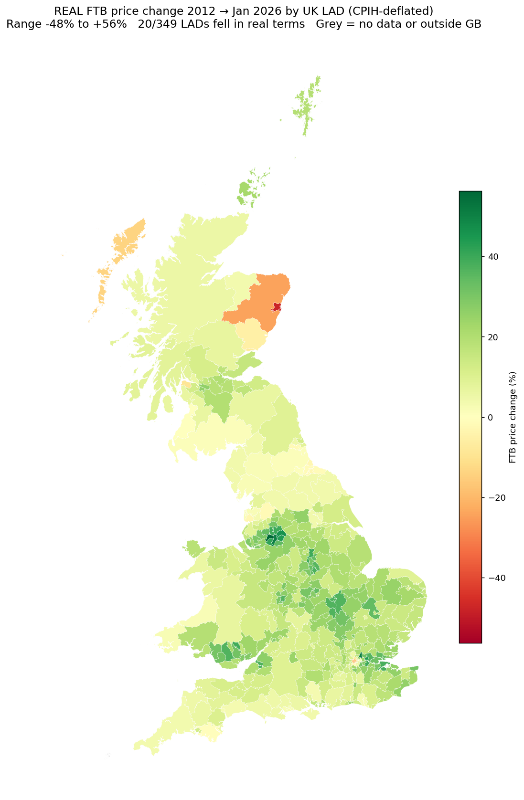
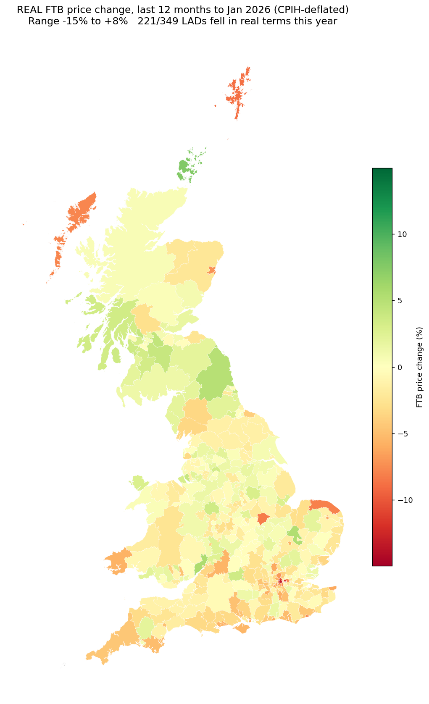
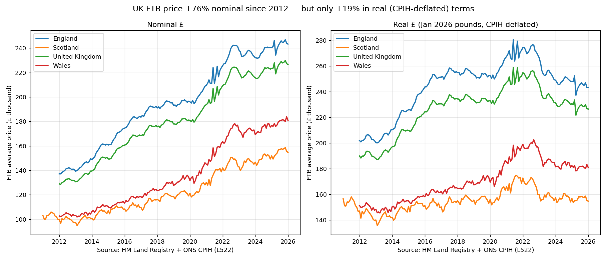
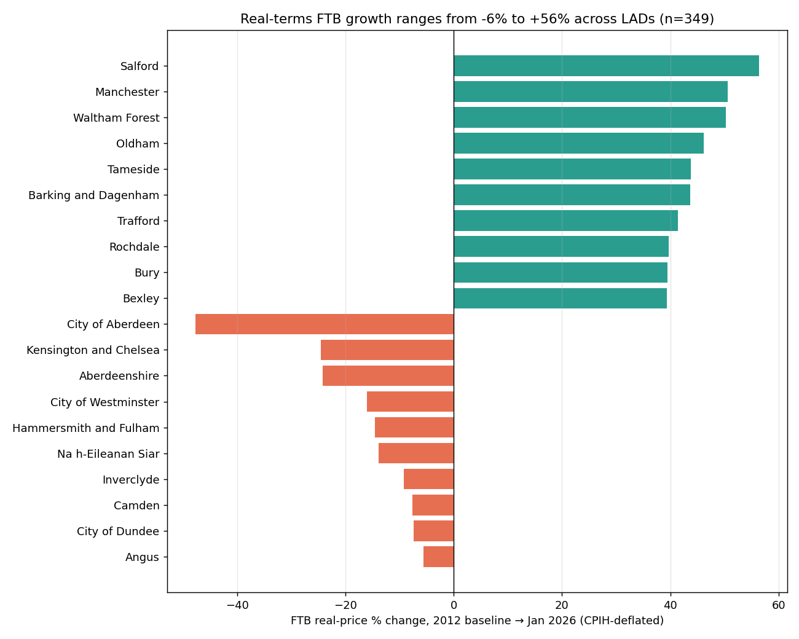
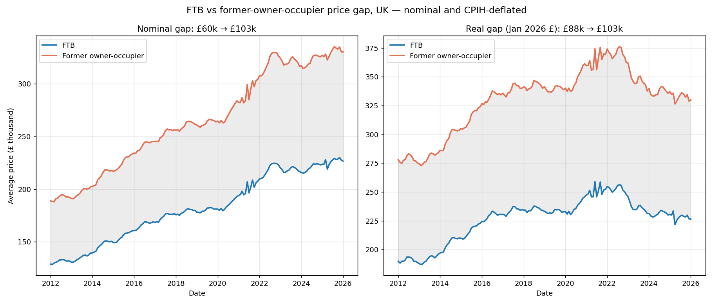

# UK First-Time Buyer Price Analysis, 2011 – January 2026

## Answer up front

Once CPIH inflation is stripped out, the picture is far less rosy than
the headline numbers suggest:

- **UK nominal FTB price growth was +72.4% (2012 → Jan 2026) but only
  +18.7% in real terms**, because CPIH inflation was +47.2% over the
  same period. Roughly two-thirds of what looks like "house-price
  growth" since 2012 was general inflation.
- **20 of 349 Local Authority Districts saw real FTB prices *fall*
  across the full period.** The worst is **City of Aberdeen at −48%
  real**; Kensington & Chelsea, Aberdeenshire, Westminster and
  Hammersmith & Fulham all fell 14–25% in real terms.
- **In the latest 12 months to Jan 2026, 221 of 349 LADs saw real FTB
  prices fall** (median −0.8% real). So even the recent "flat-to-rising"
  nominal picture hides a broad real-terms cooling.
- Some LADs still posted strong real gains: **Salford +56%, Manchester
  +51%, Waltham Forest +50%, Oldham +46%, Tameside +44%** over 14 years
  — the only genuinely large real-terms growth cluster is former
  industrial northern England plus a handful of outer-London boroughs.

All subsequent figures are **real (CPIH-deflated, in January 2026 £)**
unless explicitly labelled "nominal".

Nominal equivalents are at [`outputs/map_full_period.png`](outputs/map_full_period.png)
and [`outputs/map_latest_12m.png`](outputs/map_latest_12m.png).

Year-by-year interactive maps: [nominal](outputs/uk_ftb_interactive.html)
· [real (Jan 2026 £)](outputs/uk_ftb_interactive_real.html).

## Dataset and method

| Field | Value |
|---|---|
| Source | HM Land Registry FTB / Former-owner-occupier series, extract 2026-01 |
| Rows | 66,476 monthly observations |
| Date range | 2011-01-01 to 2026-01-01 |
| Unique regions | 391 (349 LADs + nation/UK aggregates) |
| LAD boundaries | ONS 2013 (via `martinjc/UK-GeoJSON` mirror) |
| Deflator | ONS CPIH All Items Index (series L522, 2015 = 100) |

**Why CPIH.** CPIH is ONS's preferred inflation measure and, unlike
headline CPI, includes owner-occupier housing costs, making it a more
defensible deflator for a housing analysis. RPI remains in common use
but is no longer a National Statistic.

**Baseline choice.** UK, England and Wales aggregates in this extract
start in January 2012; only Scottish LADs have 2011 data. All
full-period growth figures therefore use the **2012 full-year mean**
as the baseline, which keeps cross-nation comparisons aligned.

**Deflation convention.** Prices are expressed in January 2026 £. A
2012-vintage nominal £100,000 becomes £147,200 in Jan 2026 £ (CPIH Jan
2012 = 94.7, Jan 2026 = 139.4).

**Code reconciliation.** The dataset carries post-2013 LAD codes for
the 2019–2023 unitary reorganisations (Dorset, Buckinghamshire,
Somerset, North Yorkshire, Cumberland, Westmorland & Furness, North/West
Northamptonshire, East/West Suffolk, BCP). Each new code is expanded
onto its constituent 2013 polygons so that the new unitary's FTB value
is rendered across the same geographic footprint. Only **Isles of
Scilly** is absent (not present in the FTB series).

**Caveats.**
- Northern Ireland is not in the FTB series and does not appear.
- "Growth" here is unsmoothed average price; mix effects (what sort of
  homes FTBs actually bought each year) are not adjusted for, so small
  or high-value LADs can show jumpy monthly numbers.
- CPIH itself is a UK-wide deflator; using it on LAD prices implicitly
  assumes broadly similar inflation across regions.
- The real-terms comparisons for Scottish LADs technically start 2011,
  but we normalise all LADs to the 2012 baseline for comparability, so
  Scotland's real growth is mildly understated relative to a
  2011-baseline view.

## National trend

| Nation | Baseline £ (2011/12) | Jan 2026 £ | Nominal % | Real % | CAGR real | Latest 12m nominal | Latest 12m real |
|---|---:|---:|---:|---:|---:|---:|---:|
| UK       | 131,358 (2012) | 226,465 | +72.4 | **+18.7** | +1.27 | +1.3 | **−1.8** |
| England  | 140,077 (2012) | 243,308 | +73.7 | +19.6 | +1.32 | +1.2 | −1.8 |
| Scotland | 102,836 (2011) | 154,711 | +50.4 | +2.2  | +0.15 | +1.9 | −1.1 |
| Wales    | 103,586 (2012) | 180,859 | +74.6 | +20.3 | +1.37 | +2.4 | −0.6 |

Key observations (real terms):
- **Scotland's real FTB price is flat across 14 years** (+2% real).
  Almost all the apparent price rise there was inflation, and the
  Aberdeen oil shock dragged the national average down.
- **UK real growth of +19% over 14 years ≈ +1.3% CAGR.** Small
  compared to the cultural narrative that "house prices keep going up".
- **The latest 12-month real figure is negative for every nation.**
  Nominal rises of +1.3% to +2.4% look positive but fall short of
  the ~3% CPIH inflation over the same year.

## Real-terms winners and losers (full period)

**Top 10 by real growth (2012 → Jan 2026):**

| LAD | Code | Nominal % | **Real %** | Real CAGR |
|---|---|---:|---:|---:|
| Salford | E08000006 | +127.3 | **+56.4** | +3.34 |
| Manchester | E08000003 | +119.0 | **+50.6** | +3.06 |
| Waltham Forest | E09000031 | +118.5 | **+50.3** | +3.04 |
| Oldham | E08000004 | +112.5 | **+46.2** | +2.83 |
| Tameside | E08000008 | +109.1 | **+43.8** | +2.71 |
| Barking and Dagenham | E09000002 | +108.8 | +43.6 | +2.70 |
| Trafford | E08000009 | +105.6 | +41.4 | +2.57 |
| Rochdale | E08000005 | +103.0 | +37.9 | +2.31 |
| Bury | E08000002 | +102.8 | +37.8 | +2.30 |
| Bexley | E09000004 | +102.5 | +37.6 | +2.29 |

**Bottom 10 by real growth (full-period real losses):**

| LAD | Code | Nominal % | **Real %** | Real CAGR |
|---|---|---:|---:|---:|
| City of Aberdeen | S12000033 | −23.9 | **−47.7** | −4.66 |
| Kensington and Chelsea | E09000020 | +9.7 | **−24.5** | −2.05 |
| Aberdeenshire | S12000034 | +10.2 | **−24.2** | −2.02 |
| City of Westminster | E09000033 | +22.0 | **−16.1** | −1.28 |
| Hammersmith and Fulham | E09000013 | +24.2 | **−14.6** | −1.15 |
| Na h-Eileanan Siar | S12000013 | +25.3 | −13.9 | −1.09 |
| Inverclyde | S12000018 | +32.1 | −9.2 | −0.71 |
| Camden | E09000007 | +34.3 | −7.6 | −0.58 |
| City of Dundee | S12000042 | +34.7 | −7.4 | −0.56 |
| Angus | S12000041 | +37.3 | −5.6 | −0.42 |

**All 20 LADs with full-period real price falls:** Aberdeen, Aberdeenshire,
K&C, Westminster, Hammersmith & Fulham, Na h-Eileanan Siar, Inverclyde,
Camden, Dundee, Angus, City of London, Middlesbrough, Hartlepool, Fylde,
Gateshead, Ribble Valley, Redcar and Cleveland, Stockton-on-Tees,
Wandsworth, South Hams.

Two distinct clusters: **inner London boroughs in a prime-market
correction** and **north-east England + Aberdeen / rural Scotland in
slow-growth or declining markets**.

## Latest 12 months — real terms

**Top 10 real growth, 12 months to Jan 2026:**

| LAD | Nominal % | **Real %** |
|---|---:|---:|
| Orkney Islands | +11.1 | **+7.7** |
| Forest of Dean | +8.9 | +5.6 |
| East Cambridgeshire | +8.7 | +5.4 |
| Northumberland | +8.3 | +5.0 |
| North Lanarkshire | +7.7 | +4.4 |
| West Dunbartonshire | +7.5 | +4.2 |
| Liverpool | +7.4 | +4.1 |
| South Lanarkshire | +7.3 | +4.0 |
| South Tyneside | +7.2 | +3.9 |
| North Ayrshire | +6.9 | +3.6 |

**Bottom 10 real growth (biggest real falls in last 12 months):**

| LAD | Nominal % | **Real %** |
|---|---:|---:|
| Kensington and Chelsea | −12.3 | **−15.0** |
| City of Westminster | −10.2 | −12.9 |
| Tower Hamlets | −9.1 | −11.8 |
| Camden | −8.8 | −11.6 |
| Hammersmith and Fulham | −6.3 | −9.1 |
| City of London | −6.2 | −9.1 |
| Shetland Islands | −5.9 | −8.8 |
| Rutland | −5.4 | −8.3 |
| North Norfolk | −5.1 | −8.0 |
| Na h-Eileanan Siar | −4.8 | −7.7 |

**Headline real-terms finding for the last year: 221 of 349 LADs saw
real FTB prices fall (median −0.8% real).** Prime central London
extends its multi-year correction at double-digit rates; most of the
rest of the UK is gently slipping in real terms.

## Last 5 years in real terms

The 5-year view (Jan 2021 → Jan 2026) shows the same two-tier story
even more sharply:

**Top 5 real growth over 5 years:** Orkney Islands +11.6%, Rochdale
+10.6%, Oldham +10.5%, Blaenau Gwent +9.0%, St Helens +7.5%.

**Bottom 5 real growth over 5 years:** Kensington and Chelsea −33.0%,
City of Aberdeen −31.3%, Tower Hamlets −29.1%, Westminster −29.0%,
Lambeth −26.7%.

Inner-London boroughs have lost about **a quarter to a third of their
real FTB price** since 2021.

## Affordability gap (UK)

| Measure | 2012 | Jan 2026 |
|---|---:|---:|
| UK FTB price (nominal) | £131,358 | £226,465 |
| UK FOO price (nominal) | £191,683 | £329,867 |
| Gap (nominal) | £60,324 | £103,402 |
| FTB ÷ FOO ratio | 0.685 | 0.687 |
| UK FTB price (Jan 2026 £) | £190,745 | £226,465 |
| UK FOO price (Jan 2026 £) | £278,342 | £329,867 |
| **Gap (Jan 2026 £)** | **£87,597** | **£103,402** |

After deflation, the FTB/FOO cash gap widened from **~£88k to ~£103k
(2026 £)** over 14 years — a real widening of around £16k, not £43k as
the nominal numbers suggest. The *ratio* is essentially unchanged
(0.68 → 0.69), consistent with both FTB and FOO prices appreciating
at broadly similar real rates.

## Price levels today (Jan 2026)

**Most expensive LADs** (nominal = real at the reference date):

| LAD | Latest FTB £ |
|---|---:|
| Kensington and Chelsea | 1,031,685 |
| City of Westminster | 812,682 |
| City of London | 717,681 |
| Camden | 690,930 |
| Hammersmith and Fulham | 634,628 |

**Cheapest LADs:**

| LAD | Latest FTB £ |
|---|---:|
| Inverclyde | 94,556 |
| East Ayrshire | 108,818 |
| Na h-Eileanan Siar | 110,555 |
| West Dunbartonshire | 112,135 |
| Hartlepool | 113,692 |

The ratio of priciest to cheapest LAD is **≈10.9×** — K&C's typical
FTB price is roughly 11 Inverclydes.

## Files produced

| File | Description |
|---|---|
| `outputs/county_stats.csv` | Per-LAD nominal and real metrics |
| `outputs/data_profile.txt` | Dataset shape/coverage/missingness |
| `outputs/national_trend.png` | FTB price trajectory by nation (nominal + real) |
| `outputs/top_bottom_growth.png` | Top/bottom 10 real-growth LADs |
| `outputs/affordability_gap.png` | FTB vs FOO gap (nominal + real) |
| `outputs/map_full_period_real.png` | **Headline real-terms choropleth** |
| `outputs/map_full_period.png` | Nominal full-period choropleth |
| `outputs/map_latest_12m_real.png` | Real-terms 12-month choropleth |
| `outputs/map_latest_12m.png` | Nominal 12-month choropleth |
| `outputs/uk_ftb_interactive_real.html` | Interactive year-slider, real £ |
| `outputs/uk_ftb_interactive.html` | Interactive year-slider, nominal £ |

Produced by `analysis/analyse.py`, `analysis/maps.py`, and
`analysis/inflation.py`.
